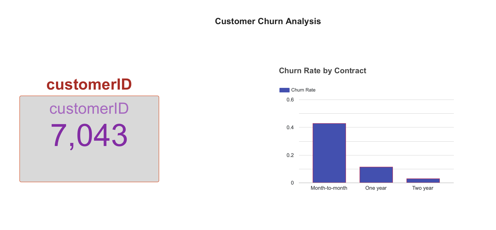

# Customer Churn Analysis — Telecom Company

An end-to-end data analysis project analyzing 7,043 customer records to uncover why a telecom company is losing customers.

## Business Problem
The company has a **26.5% annual churn rate**. This project identifies the key drivers of churn and proposes data-informed retention strategies.

## Tools Used
- **Python (Pandas)** — Data cleaning and feature engineering
- **SQL (SQLite)** — Querying, segmentation, and aggregation
- **Google Looker Studio** — Interactive dashboard

## Key Findings
1. **Overall Churn Rate:** 26.5% (1,869 of 7,043 customers)
2. **Contract Type is the #1 Driver:** Month-to-month customers churn at **42.7%** vs. **2.8%** for two-year contracts.
3. **Tenure Matters:** Churned customers stay an average of **18 months** vs. **37.6 months** for retained customers.
4. **Higher Bills, Higher Churn:** Churned customers pay **$74.44/month** vs. **$61.27/month** for retained customers.

## Recommendations
1. **Convert Month-to-Month Customers** — Offer a discount to move them onto 1-year or 2-year contracts.
2. **First-Year Onboarding Program** — Implement check-ins during the first 12 months to catch issues early.
3. **Review High-Price Plans** — Add extra perks to justify higher monthly charges.

## Live Dashboard
🔗 
(https://datastudio.google.com/reporting/b87b42bd-bf91-41c8-9a22-2fb3075447f0)

## Project Structure
Churn-Project/
├── data/
│   ├── churn.csv (raw)
│   └── cleaned_churn.csv
├── notebooks/
│   ├── 01_cleaning.py
│   └── 02_sql_analysis.py
└── README.md

## How to Reproduce
1. Download the dataset from [Kaggle](https://www.kaggle.com/datasets/blastchar/telco-customer-churn).
2. Place it in `data/churn.csv`.
3. Install packages: `pip3 install pandas sqlalchemy`
4. Run: `python3 notebooks/01_cleaning.py`
5. Run: `python3 notebooks/02_sql_analysis.py`
